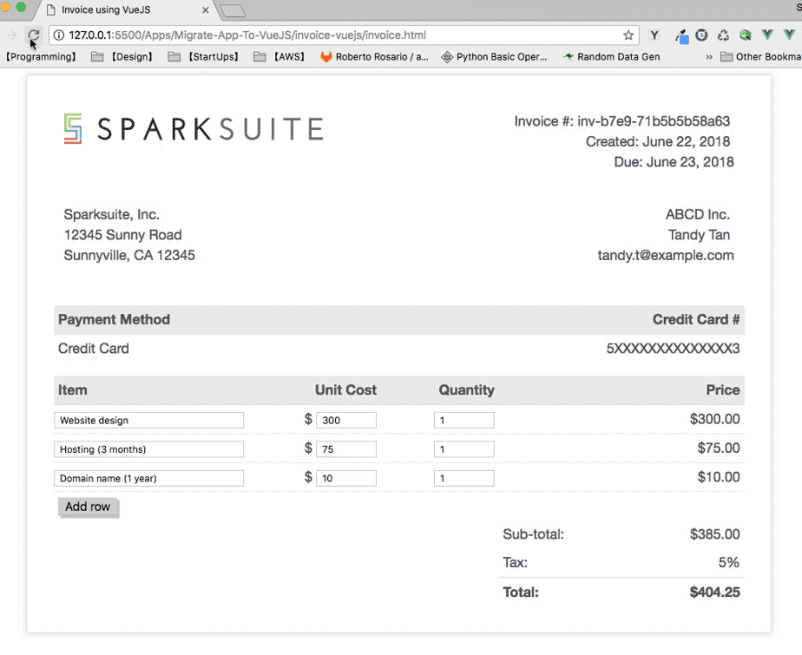

# Migrate an App to VueJS

> This application is much inspired by this article [Replacing jQuery with Vue](https://www.sitepoint.com/replacing-jquery-vue/). However, jQuery is not used in my application.

## Requirements:

- Use this [open-source template from Sparksuite](https://github.com/sparksuite/simple-html-invoice-template) as a start
- Program in both the declarative programming paradigm and imperative programming paradigm
- User can add new items
- User can change an items information
- Recalculate the prices whenever a user changes an item's unit cost or quantity

#### The implementation is demonstrated bellow

#### Source code

The source code in vanilla JavaScript can be found [here](../Migrate-App-To-VueJS/invoice-vanilla-js)

The source code in Vue.js can be found [here](../Migrate-App-To-VueJS/invoice-vuejs). Please be noted, this version does not involve `vue-cli` and `Webpack` tools.

## Summary & Tips

### 1. Downside of vanilla JavaScript, or jQuery.

- The majority of it reads as a list of instructions on **how to manipulate the DOM**. The purpose of each section of code — the “what” — is often hard to make out through the details of “how” it’s being done.

- There is **no single source of truth**. As we’re keeping our application state in the DOM itself. Information about the items ordered exists only as part of the HTML making up the UI. This might not seem like a big problem when we’re only displaying the information in a single location, but as soon as we start needing to display the same data in multiple places in our app, it becomes increasingly complex to ensure that each piece is kept in-sync.

### 2. The benefits of Vue (similar to React).

- **The UI is declarative**: you only need concern yourself with what you want to see, not how to manipulate the DOM to achieve it.

- **The clear separation between the UI, and the logic/data that drives it**: the code is much easier to understand, and lends itself to easier testing. Most important: it brings **a single source of truth**.
