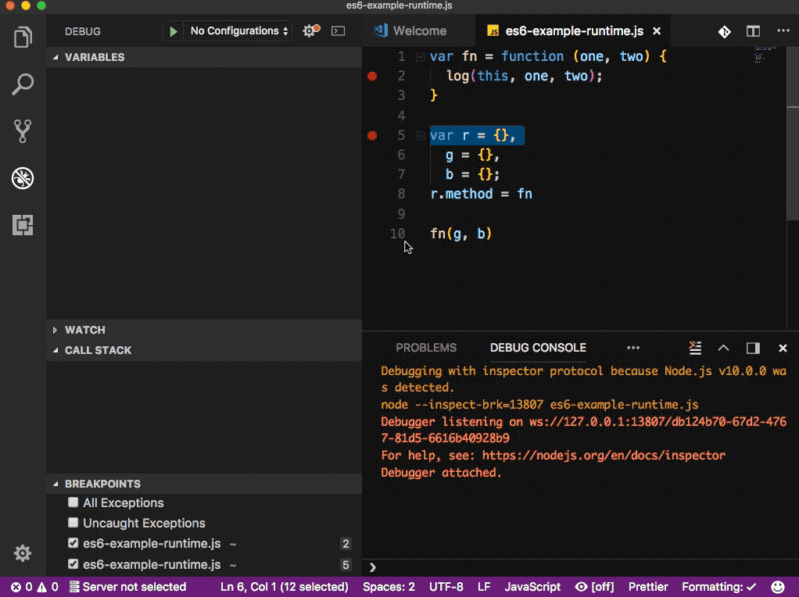

# "this" and Regular Functions

To get a handle on how `this` works differently with arrow functions, let's do a quick recap of how `this` works in a standard function.

The value of the `this` keyword is based completely on how its function (or method) is called. `this` could be any of the following:

### 1. A new object

If the function is called with `new`:

```js
const mySundae = new Sundae("Chocolate", ["Sprinkles", "Hot Fudge"]);
```

In the code above, the value of `this` inside the `Sundae` constructor function is a new object because it was called with `new`.

### 2. A specified object

If the function is invoked with `call`/`apply`:

```js
const result = obj1.printName.call(obj2);
```

In the code above, the value of `this` inside `printName()` will refer to `obj2` since the first parameter of `call()` is to explicitly set what `this` refers to.

### 3. A context object

If the function is a method of an object:

```js
data.teleport();
```

In the code above, the value of `this` inside `teleport()` will refer to `data`.

### 4. The global object or undefined

If the function is called with no context:

```js
teleport();
```

In the code above, the value of `this` inside `teleport()` is either the `global` object or, if in _strict mode_, it's `undefined`.

Here is a more concrete example:



> **TIP:** `this` in JavaScript is a complicated topic. We just did a quick overview, but for an in-depth look at how this is determined, check out [this All Makes Sense Now](https://github.com/getify/You-Dont-Know-JS/blob/master/this%20%26%20object%20prototypes/ch2.md)! from Kyle Simpson's book series [You Don't Know JS](https://github.com/getify/You-Dont-Know-JS/blob/master/README.md).

## Quiz

1.  What is the value of `this` inside the `Train` constructor function below?

```js
const redTrain = new Train("red");
```

> **Answer:** a new object, since the `new` keyword is used.

2.  What is the value of `this` inside the `increaseSpeed()` function below?

```js
const redTrain = new Train("red");
redTrain.increaseSpeed(25);
```

> **Answer:** The `redTrain` object. Since the `increaseSpeed()` function is called from a context object (`redTrain`) that context object will be the value of this in the function.
