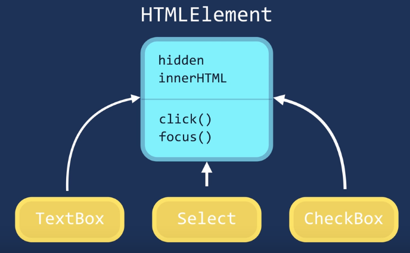

# Object-Oriented Programing in JavaScript

## Object-Oriented Programing (OOP)

There are four core concepts in OOP:

* `Encapsulation`
* `Abstraction`
* `Inheritance`
* `Polymorphism`

A **object** is a unit which is composed with **properties** (variables) and method (functions).

```js
// A simple Object
let employee = {
  baseSalary: 30000, // <- property
  overtime: 10, // <- property
  rate: 20, // <- property
  getWage: function() {
    // <- method
    return this.baseSalary + this.overtime * this.rate;
  }
};
```

### Encapsulation

In OOP, we group related variables and functions operate on them into objects. This is what so-called **`Encapsulation`**.

```js
// Class & Instance
class Employee {
  constructor(baseSalary = 30000, overtime = 10, rate = 20) {
    this.baseSalary = baseSalary;
    this.overtime = overtime;
    this.rate = rate;
  }

  getWage() {
    return this.baseSalary + this.overtime * this.rate;
  }
}

const tandy = new Employee((baseSalary = 50000), (rate = 25));
tandy.getWage;
```

Using **`Encapsulation`** helps us to reduced complexity and increase reusability.

> `50500`

### Abstraction

Hide some of the properties and methods from the outside, that you only concern about a few, this is call `Abstraction` in OOP. Look at an example, an iPhone has so many components inside, but a user has been exposed only a few buttons, cameras and a touch interface to interact with. They do not need to know what is exactly happening inside. This is abstraction in action.

With **`Abstraction`**, we hide the details and complexity to (1) make an object with simpler interfaces, (2) reduce the impact of change.

### Inheritance

**Inheritance** is a mechanism to helps us remove redundant code. For example, in HTML, _TextBox_, _Select ,\_CheckBox_, al those elements have something in common: they all have properties like `hidden`, `innerHTML`, methods like `click()` and `focus()`. Instead of defining them for each one of the object, we can define them once in a generic object `HTMLElement`, and inherit from this generic object. In this we, we can remove tons of redundant code.



### Polymorphism

**Polymorphism** means **many forms** literally. In OOP, it is the practice of designing objects to _share behaviors_ and to be able to _override shared behaviors with specific ones_. Polymorphism takes advantage of inheritance in order to make this happen. In the HTML element example above, each element has a `render()` function to rend to the page. But the way each element renders is different from the others.

Using **Polymorphism** we can refactor ugly switch/case statements.
