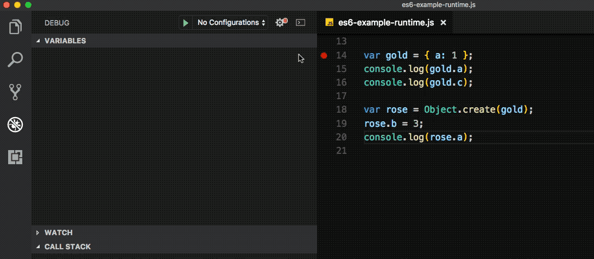

# Prototype Chains

As learnt before, the keyword `class` introduced in ES6 is **syntactical sugar**, JavaScript remains **prototype-based**.

A JavaScript object instance only has one construct: **objects**. Each object has a _private property_ which _holds a link to another object_ called its **prototype**. _That prototype object has a prototype of its own, and so on until an object is reached with `null` as its prototype_. By definition, `null` has no prototype, and acts as the final link in this _prototype chain_. Check the animated gif bellow to see the objects `gold` and `rose`, and their prototype chains.



**Prototype Chains** are mechanisms for making objects the resemble other objects. This makes one object behaves as if it has all the properties of the other object, by _delegating the fields lookups from the first object to the other object_.

**Nearly all objects** in JavaScript are instances of `Object` which sits on the top of a _prototype chain_. To better understand the prototype chain in depth, the following code are in **ES5 style**, rather than **ES6**.

#### Property Lookup

```js
var gold = { a: 1 };
console.log(gold.a); // 1
console.log(gold.c); // undefined
```

#### 1-time property copying

```js
var blue = jQuery.extend({}, gold); // using JQuery library
```

Any changes to `blue` or `gold` will not affect the other one. In other words, they are **not in-sync**.

```js
blue.b = 2;
console.log(blue.a); // 1
console.log(blue.b); // 2
console.log(gold.b); // undefined
```

#### Property Delegating

```js
var rose = Object.create(gold);
rose.b = 3;
console.log(rose.a); // 1
```

Refer to the animated gif above for the prototype chains.

The `delegating` is fundamentally different from `copying`. if we add a new property in `gold`, then accessing to the new property in `blue` and `rose` be different.

```js
gold.z = 4;
console.log(blue.z); // undefined
console.log(rose.z); // 4
```

See the [Object.prototype documentation](https://developer.mozilla.org/en-US/docs/Web/JavaScript/Reference/Global_Objects/Object/prototype) for all the `Object` prototype object, for example, the mostly used `Object.prototype.toString()` property.

## Array Prototype

As stated before, "**Nearly all objects** in JavaScript are instances of `Object` ... ", the only exception is the [Array Prototype: Array.prototype](https://developer.mozilla.org/en-US/docs/Web/JavaScript/Reference/Global_Objects/Array/prototype). The `Array.prototype` property represents the prototype for the `Array` constructor and allows you to add new properties and methods to all `Array` objects.
